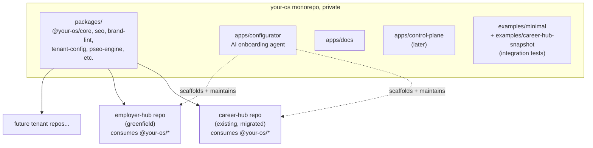
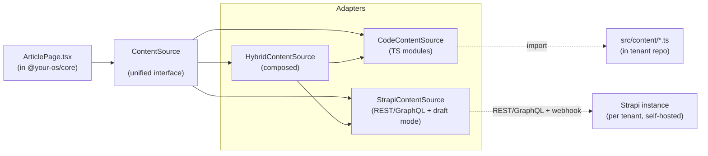
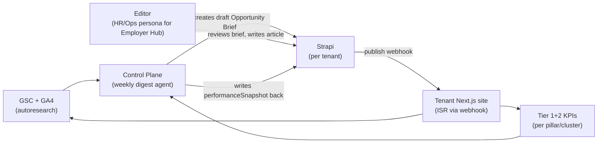
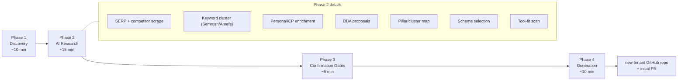
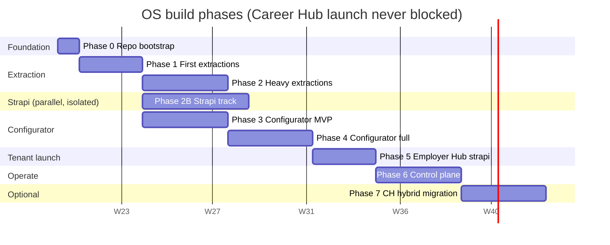
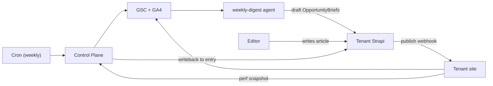

# Multi-Tenant SEO Content OS — Build Plan

> **Status (current)**: Phases 0–7 are all marked `completed` in the frontmatter. The repo is in v1 maintenance + v1.1 (Web Shell) work. Read this document as the **historical reference** for what was built and why. Current status is the README's [phase status table](../README.md#status); current monorepo health is `pnpm turbo run build typecheck test` (target: green).
>
> **External link convention**: links beginning with `nextjs-app/...` point into the **Career Hub source repo** (the sibling repo from which packages were extracted), not into `your-os/`. They're preserved here so the extraction lineage is auditable. They will not resolve from inside `your-os/`.

## Strategic shape

Three repositories, clean isolation:




Career Hub keeps its current repo and Vercel project — zero deploy disruption. It progressively migrates from inline code to `@your-os/*` packages, package by package, with byte-equivalence gates.

Employer Hub is greenfield, scaffolded by the AI configurator as the first true onboarding flow.

## Why this shape (vs the alternatives)

- **Separate tenant repos** keep blast radius per-tenant, support independent deploy cadences, and let external tenants exist later without touching internal repos.
- **OS as private monorepo** with versioned packages means tenants take updates via `pnpm up @your-os/`* instead of merging diffs. This is the difference between a real OS and a copy-paste boilerplate.
- **Career Hub stays where it is** during the migration — no risky big-bang move. We extract one package at a time and re-point Career Hub's imports, with byte-equivalence required at each step.
- **Employer Hub waits for the configurator** because the user explicitly wants the configurator to be the moat and to prove its quality on the first real B2B onboarding. Risk mitigated by a hard week-12 gate.

## The four-layer architecture

- **Layer 1 — OS engine** (`your-os/packages/`*): versioned npm packages.
- **Layer 2 — Tenant template** (`your-os/packages/cli` `your-os init`): scaffolds a new tenant repo with the canonical minimal shape.
- **Layer 3 — Configurator** (`your-os/apps/configurator`): AI-driven onboarding that fills `tenant.config.ts` + provisions Strapi (when applicable) + seeds content.
- **Layer 4 — Tenant instances** (`career-hub`, `employer-hub`, future): per-tenant repos (+ optional dedicated Strapi instance) that consume Layer 1 + were scaffolded by Layer 3.

## The Strapi integration model — `@your-os/content-source` abstraction

Strapi is a first-class concern but **must not couple** the OS to one CMS. Tenants choose `code | strapi | hybrid` per content type. The seam is a single `ContentSource` interface that every page reads through:

```ts
interface ContentSource<T extends ContentType> {
  list(opts?: ListOpts): Promise<T[]>;
  get(slug: string, opts?: GetOpts): Promise<T | null>;
  listSlugs(): Promise<string[]>;        // for generateStaticParams
  getRevisionsSince(iso: string): Promise<Revision[]>; // for ISR + audits
  warmCache?(): Promise<void>;           // build-time prefetch
}
```

Three concrete adapters, all interchangeable per content-type:

- `CodeContentSource<T>` — reads from typed TS modules (Career Hub today). Zero runtime, type-safe, build-time.
- `StrapiContentSource<T>` — reads from a Strapi REST/GraphQL endpoint with TypeScript types generated from the Strapi schema (`@your-os/strapi-codegen`). Cached, draft-aware, ISR-ready.
- `HybridContentSource<T>` — composed: e.g. articles from Strapi, pillar registry from code. Resolves per-content-type via tenant config.

`tenantConfig.contentSources` maps each content type to an adapter:

```ts
contentSources: {
  articles:    { mode: "strapi", strapiCollection: "articles" },
  caseStudies: { mode: "strapi", strapiCollection: "case-studies" },
  pillars:     { mode: "code",   path: "@/content/pillars" },
  tools:       { mode: "code",   path: "@/content/tools" },
  pSeoCells:   { mode: "code",   generator: "@your-os/pseo-engine" },
}
```

This is the single most important abstraction in the OS. Get it right and:

- Career Hub stays code-mode forever if the team prefers it.
- Employer Hub launches strapi-mode from day 1 with editor empowerment.
- A future tenant can mix (Strapi for articles, code for tool registry).
- The same page component renders both — no fork in `RolePage.tsx` or `ArticlePage.tsx`.




## Strapi-per-tenant operational model

- **One Strapi instance per tenant**, self-hosted on Render/Railway/Fly via `@your-os/strapi-deploy` template (managed Postgres + S3-compatible media bucket).
- **Schema-as-code**: Strapi content-types live in `@your-os/strapi-template` as JSON schema files committed to git. Tenant Strapi instances pull schema updates via a migration runner — never hand-edited in production admin UI. This is non-negotiable for an OS (you can't ship updates if tenant Strapi schemas drift).
- **Per-tenant secrets** (Strapi API token, webhook secret, draft mode secret) injected into the tenant Next.js app at deploy time via Vercel env vars.
- **Webhooks**: Strapi `entry.publish` / `entry.update` / `entry.unpublish` → POST to tenant's `/api/revalidate` endpoint with HMAC signature → calls `revalidateTag()` per Next.js content-type tag → ISR refreshes within 60s.
- **Draft mode**: Strapi's native preview feature configured to call tenant's `/api/preview` route → enables Next.js draft mode → page reads `?status=draft` from Strapi.
- **Backup**: nightly Postgres + S3 snapshots per tenant via `@your-os/strapi-deploy`.
- **Cost**: ~$15-30/mo per tenant for small instances (Render Postgres + small Strapi container + S3 storage). Scales linearly.

## Strapi → SEO integration (the data-driven autoresearch loop)

This is where Strapi becomes the **operational nerve center** for the SEO growth loop, not just a content store. Every editorial entity in Strapi gets first-class SEO + research fields:

- **SEO plugin schema** (universal across tenants, in `@your-os/strapi-seo`): `metaTitle`, `metaDescription`, `canonicalURL`, `ogImage`, `noIndex`, `structuredDataOverride`, `keywords[]`, `pillar` (relation), `cluster` (relation), `intent` (enum: informational/transactional/commercial/navigational), `funnelStage`, `targetPersona` (relation), `targetCEP` (relation), `dateModified` (auto-managed).
- **Pillar + Cluster as Strapi content-types**: editors see the topical map in admin. Adding an article requires picking a pillar + cluster — taxonomy enforcement in the CMS, not the engineer's head.
- **Persona + ICP as Strapi content-types**: editors tag every article with target persona; analytics (Phase 6 control plane) reports performance per persona.
- **Opportunity briefs as Strapi drafts**: the Phase 6 weekly digest agent doesn't post to Slack only — it **creates draft entries in Strapi** with the opportunity prefilled (suggested title, target keyword, pillar, cluster, citation seeds, internal-link suggestions, target word count). Editor opens admin, reviews the brief, accepts/edits, writes the article. **The autoresearch loop becomes a CMS workflow** instead of a documents-in-Slack workflow. This is the single best thing Strapi enables.
- **Performance attribution write-back**: when GSC reports an article hits position 3, the control plane writes back to the Strapi entry's `performanceSnapshot` field — editors see ranking history in the same admin where they edit content.
- **Brand lint as Strapi lifecycle hook**: `beforePublish` calls `@your-os/brand-lint` API → blocks publish on banned phrases / DBA prevalence < 80% / missing citations. Editorial gates enforced at the CMS layer, not just CI.




This closes the loop: **autoresearch finds opportunity → CMS draft → editor publishes → site updates via ISR → analytics flows back to CMS → next autoresearch cycle sees the result.** That's the data-driven moat the user asked for.

## The universal injection point: `tenant.config.ts`

Single typed object (Zod-validated) that every package and skill reads. Concrete shape captures the divergence between Career Hub (B2C, code-mode) and Employer Hub (B2B, strapi-mode):

- `identity` — name, domain, industry, business model (`b2c | b2b | marketplace`)
- `audience` — personas (B2C) OR ICPs + buying committees + CEPs (B2B)
- `conversion` — primary event (`app_install | demo_booking | sql | newsletter | purchase`), CTA copy patterns, attribution params
- `brand` — DBAs (Romaniuk-style, with prevalence target), banned phrases, voice, reading-level, POV
- `seo` — primary schema type, pillars, content-class targets (60/25/15 vs B2B's TOFU/MOFU/BOFU/sales-enablement), E-E-A-T signals
- `pSEO` — enabled, dimensions (`city x role` vs `industry x company-size x use-case`), templates
- `tools` — enabled tool engines (calculator, decision-tool, ROI-calculator for B2B)
- `trust` — case studies, customer logos, compliance badges (B2B), worker reviews (B2C)
- `analytics` — GA4/PostHog/Segment IDs, conversion event names, attribution UTM model
- `performance` — CWV budgets per route type
- `integrations` — CRM (HubSpot/Salesforce for B2B), CMS, email
- `agentContext` — what `AGENTS.md` should emphasize for this tenant
- `**contentSources`** — per content-type adapter selection: `{ articles: { mode: "strapi" }, pillars: { mode: "code" }, ... }` (the Strapi/code/hybrid switch)
- `**strapi**` — only present when any contentSource uses strapi-mode: `{ baseUrl, apiTokenEnv, webhookSecretEnv, draftSecretEnv, schemaTemplate: "@your-os/strapi-template@1.x" }`

## Repo structure (the new `your-os` monorepo)

```
your-os/
├── apps/
│   ├── docs/                    Fumadocs, public from day 1
│   ├── configurator/            Next.js + AI SDK, the onboarding agent
│   └── control-plane/           Hosted dashboard (Phase 5, optional)
├── packages/
│   ├── tenant-config/           Zod schema + defineTenant() + types (incl. contentSources, strapi)
│   ├── content-source/          ⭐ Unified ContentSource interface + Code/Strapi/Hybrid adapters
│   ├── content-types/           Article/Guide/Tool/Location/CaseStudy/Pillar/Persona/Brief types
│   ├── core/                    Page shells, layout, theming primitives (CMS-agnostic)
│   ├── seo/                     metadata, JSON-LD, sitemap, robots
│   ├── pseo-engine/             Programmatic SEO scaffolding (always code-source)
│   ├── tools-engine/            Calculator/decision-tool framework
│   ├── analytics/               GA4/PostHog/Segment, attribution
│   ├── brand-lint/              Brand DBA + banned-phrase + citation-density linter
│   ├── strapi-template/         ⭐ Strapi schema-as-code template + migration runner
│   ├── strapi-deploy/           ⭐ Render/Railway/Fly deploy templates + Postgres + S3
│   ├── strapi-sync/             ⭐ Webhook handler, /api/revalidate, /api/preview, ISR tags
│   ├── strapi-seo/              ⭐ Strapi SEO plugin schema bundle (meta/OG/JSON-LD per type)
│   ├── strapi-codegen/          ⭐ Generate TS types + Zod schemas from Strapi content-types
│   ├── strapi-brand-lint-hook/  ⭐ Strapi lifecycle hook → @your-os/brand-lint at publish-time
│   ├── cli/                     `your-os init|add|lint|audit|sync|strapi:*`
│   ├── skills/                  The .agents/skills/ tree, versioned (~15-20 skills)
│   ├── agent-context/           Generates AGENTS.md from tenant.config.ts
│   ├── migrate-to-strapi/       Codemod: TS data files → Strapi entries (Phase 7)
│   ├── eslint-config/           or biome-config (match Career Hub's choice)
│   ├── typescript-config/
│   └── tailwind-config/
├── examples/
│   ├── minimal/                 Bare-min tenant code-mode for CI integration test
│   ├── minimal-strapi/          ⭐ Bare-min tenant strapi-mode for CI integration test
│   └── career-hub-snapshot/     Snapshot of CH config for byte-equivalence tests
├── tooling/
│   ├── scripts/
│   └── codemods/                Tenant-config migration codemods
├── .agents/                     OS-development guidance (NOT shipped to tenants)
│   ├── rules/
│   └── skills/
├── .changeset/
├── .github/workflows/
├── pnpm-workspace.yaml
├── turbo.json
└── biome.json
```

Two `.agents/` folders: monorepo-root for working *on* the OS, `packages/skills/` for what ships *to* tenants. Different audiences.

## Operational decisions (locked in)

- **Monorepo tool**: Turborepo + pnpm workspaces (matches Career Hub's pnpm@10).
- **Versioning**: Changesets, independent versioning per package.
- **Linter**: Biome (parity with Career Hub).
- **Registry**: npm scoped `@your-os/`*, private until v0.1 public release.
- **Licensing**: BSL initially (lets you sell licenses while staying source-available); MIT-able later.
- **CI**: GitHub Actions + Turbo Remote Cache.
- **Preview deploys**: every PR gets previews for `apps/docs`, `apps/configurator`, `examples/minimal`, `examples/career-hub-snapshot`.
- **Branching**: `main` always shippable, no `develop`.
- **Codemods**: jscodeshift + ts-morph in `tooling/codemods/`, required for any breaking `tenant.config.ts` schema change.

## The configurator (the moat) — 4-phase design




- **Phase 1 — Discovery (conversational, structured)**: 12–15 questions producing `tenant.brief.json`. Different question tree per business model (B2C vs B2B vs marketplace).
- **Phase 2 — AI Research (autonomous, ~15 min, real budget)**: SERP scrape, keyword clustering, competitor sitemap parsing, ICP/persona enrichment, DBA proposal, pillar map, schema selection, tool-fit scan. **Outputs grounded in real data, not LLM speculation.** Graded against a golden set.
- **Phase 3 — Confirmation gates (human, ~5 min)**: tenant reviews/edits in a UI; strategic decisions stay human.
- **Phase 4 — Generation (autonomous, ~10 min)**: scaffolds tenant repo via `@your-os/cli`, fills `tenant.config.ts`, generates seed content (1 pillar page + 3–5 spokes per pillar), wires analytics, opens initial PR.

**Round-trip validation**: configurator must be able to produce Career Hub's existing `tenant.config.ts` (within tolerance) from a guided session before Employer Hub onboarding begins. This is the quality gate.

## The 6-phase, ~16-week build plan




### Phase 0 — Repo bootstrap (week 1)

- Create private GitHub repo `your-org/your-os`.
- Bootstrap monorepo: pnpm-workspace, Turborepo, Biome, Changesets, Vitest, TypeScript base config.
- Empty `apps/docs` (Fumadocs), empty `examples/minimal`, empty `packages/{tenant-config,core,seo,brand-lint,cli}`.
- GitHub Actions: lint, typecheck, test, build, all via `turbo run`.
- Turbo Remote Cache.
- CODEOWNERS, CONTRIBUTING.md, LICENSE (BSL).
- Empty release pipeline (Changesets `Version Packages` PR workflow).
- **Gate**: CI green on empty monorepo.

### Phase 1 — First extractions (weeks 2–4)

Four small extractions in strict order, each validated by re-pointing Career Hub. Career Hub stays in code-mode throughout — no Strapi anywhere yet.

1. **`@your-os/tenant-config`**: Zod schema + `defineTenant()` including `contentSources` and `strapi` fields (Career Hub fills `contentSources` with all `mode: "code"`). Pure type-level extraction.
2. **`@your-os/content-source`** (code adapter only): the `ContentSource` interface + `CodeContentSource`. Career Hub's `getRolesBySlug` / `getCitiesBySlug` style helpers re-implemented behind it. Career Hub keeps its current TS data files; only the access path changes. **Strapi adapter not built yet — that's Phase 2B.**
3. **`@your-os/brand-lint`**: extract [nextjs-app/scripts/agents/brand-lint.mjs](nextjs-app/scripts/agents/brand-lint.mjs) into a package that reads DBAs/banned-phrases from `tenantConfig.brand`. Career Hub replaces `pnpm brand:lint` with `pnpm exec your-os brand-lint`. **Byte-equivalent output required.**
4. **`@your-os/seo`**: extract metadata/JSON-LD/sitemap helpers from [nextjs-app/src/lib/seo](nextjs-app/src/lib/seo) and [nextjs-app/src/shared/seo](nextjs-app/src/shared/seo). Career Hub re-points imports. **Built HTML must be byte-identical** before/after for 10 representative routes.

- **Gate**: Career Hub deploys cleanly using all four packages; SEO audit + brand-lint outputs unchanged; pages render via `CodeContentSource` with no behavior change.

### Phase 2 — Heavy extractions (weeks 5–8)

Done in parallel with Phase 2B Strapi track and Phase 3 configurator MVP work. Career Hub stays code-mode throughout.

- **`@your-os/core`**: page shells (`StandardPageLayout`, `ContentPageShell`, `ToolPageShell`, `RolePageShell`), `PageContainer`, `PageSection`, `FAQSection`, `CTASection`, `InternalLinkHub`. Parameterized by `tenantConfig.brand` + `tenantConfig.identity`. **CMS-agnostic** — page components receive content via `ContentSource`, never know if it came from code or Strapi.
- **`@your-os/content-types`**: generic Article/Guide/Tool/Location/Pillar/Persona/CaseStudy/Brief TS types extracted from current feature data shapes.
- **`@your-os/analytics`**: extract from [nextjs-app/src/lib/analytics.ts](nextjs-app/src/lib/analytics.ts), parameterize conversion event from `tenantConfig.conversion`.
- **`@your-os/pseo-engine`**: programmatic SEO scaffolding (current `roles x cities` pattern generalized to N-dimensional). Always code-source (pSEO cells are generated, not edited in CMS).
- **`@your-os/tools-engine`**: calculator/decision-tool framework from [nextjs-app/src/lib/calculators](nextjs-app/src/lib/calculators) + tool registry pattern.
- **`@your-os/cli`**: `your-os init`, `your-os add page|tool|pillar`, `your-os lint`, `your-os audit`, `your-os sync` (regenerates AGENTS.md). Strapi sub-commands stubbed; implemented in Phase 2B.
- **`@your-os/agent-context`**: generates per-tenant `AGENTS.md` / `CLAUDE.md` / `.cursor/rules/` from `tenantConfig.agentContext` + `@your-os/skills`.
- **`@your-os/skills`**: extract trimmed-down skills tree (~15-20 skills) from current `.agents/skills/`. Cuts: collapse content/* (8→3), drop ops/* docs without backing scripts, drop unbuilt MAS stage agents. Add `strapi-content-modeling` skill (when to use Strapi vs code, content-type design patterns).
- **Gate**: Career Hub fully running on `@your-os/*` packages in code-mode, no inline duplicates. `examples/career-hub-snapshot` exists as thin re-deploy of Career Hub's config for CI integration testing.

### Phase 2B — Strapi track (weeks 5–9, parallel + isolated from Career Hub)

This entire track has **zero touch on Career Hub's repo or deploy pipeline**. Career Hub continues launching on schedule. All work happens in `your-os` packages and `examples/minimal-strapi`.

- **`@your-os/strapi-template`**: a reference Strapi 5 project with schema-as-code (content-types as JSON schema files committed to git), a migration runner, lifecycle hooks, the `@your-os/strapi-seo` plugin pre-installed, and seed data. Versioned: tenants pin to `@your-os/strapi-template@1.x` and migrate via `your-os strapi:migrate`. Includes default content-types: `Article`, `Pillar`, `Cluster`, `Persona`, `ICP`, `CaseStudy`, `OpportunityBrief`, `RoleGuide`.
- **`@your-os/strapi-deploy`**: Render/Railway/Fly deploy templates (Dockerfile + IaC) with managed Postgres + S3-compatible media bucket + nightly backups + restore script. One command (`your-os strapi:deploy --tenant employer-hub --provider render`) provisions a tenant's Strapi instance.
- **`@your-os/strapi-sync`**: Next.js side of webhooks. Provides:
  - `/api/revalidate` route handler with HMAC verification, mapping Strapi `entry.publish|update|unpublish` events to `revalidateTag()` calls per content-type.
  - `/api/preview` and `/api/exit-preview` for Strapi 5's native preview feature.
  - Tag-naming convention: `{tenant}:{contentType}:{slug}` and `{tenant}:{contentType}:list`.
  - Latency target: webhook → live page update ≤ 60s p95.
- **`@your-os/strapi-seo`**: Strapi plugin bundle with universal SEO schema (`metaTitle`, `metaDescription`, `canonicalURL`, `ogImage`, `noIndex`, `structuredDataOverride`, `keywords[]`, `pillar`, `cluster`, `intent`, `funnelStage`, `targetPersona`, `dateModified`). Auto-attached to every content-type. Surfaces SEO scoring in admin UI (Yoast-style: title length, description length, keyword density, internal-link density, missing alt text on images).
- **`@your-os/strapi-codegen`**: introspects a Strapi instance's schema → generates TypeScript types + Zod runtime schemas → consumed by `StrapiContentSource<T>` for full type safety. Run on tenant deploy via `your-os strapi:codegen`.
- **`@your-os/strapi-brand-lint-hook`**: Strapi `beforePublish` lifecycle hook that calls `@your-os/brand-lint` API. **Blocks publish** on banned phrases, DBA prevalence < target, missing inline citations on stat claims, missing AuthorByline. Editorial gates enforced at the CMS layer, not just CI. Returns structured errors that Strapi admin renders inline.
- **`@your-os/content-source` Strapi adapter**: `StrapiContentSource<T>` implementing the same interface as `CodeContentSource<T>`. Reads from REST or GraphQL based on `tenantConfig.strapi.transport`. Draft-aware (returns drafts when Next.js draft mode is active). Falls back to last-known-good cache on Strapi outage (resilience requirement — tenant site never breaks because Strapi is down).
- **`examples/minimal-strapi/`**: parallel to `examples/minimal`, same pages, but `contentSources.articles.mode = "strapi"`. Includes Docker Compose for local Strapi dev. CI spins up Strapi + Postgres in a service container, seeds it, asserts content roundtrip.
- **Gate**: `examples/minimal-strapi` builds + deploys; an editor edit in Strapi admin → publish → tenant Next.js page reflects change ≤ 60s; brand-lint blocks a deliberately-bad publish in admin UI; codegen produces correct TS types. **Career Hub still untouched.**

### Phase 3 — Configurator MVP (weeks 5–8, parallel with Phase 2 + 2B)

Built independently so it doesn't block extraction or Strapi work.

- `apps/configurator/` Next.js app with AI SDK.
- **Phase 1 (Discovery)** UI: question tree, branching by business model, outputs `tenant.brief.json`. Includes a key question: **"How will your editorial team work?"** (`developer-only-code-mode | non-technical-team-strapi-mode | mixed-hybrid-mode`). This decision drives the rest.
- **Phase 4 (Generation)** scaffold: shells out to `@your-os/cli`. For strapi-mode tenants, also provisions a Strapi instance via `@your-os/strapi-deploy`, generates Strapi schema from the questionnaire's pillar/persona/content-type answers, runs `@your-os/strapi-codegen`, wires webhooks. Opens GitHub PR(s) via OAuth.
- Skip Phase 2 (AI research) and Phase 3 (confirmation) for MVP — user fills pillars/personas/DBAs in the questionnaire.
- **Gate**: configurator MVP scaffolds both `examples/minimal` (code-mode) AND `examples/minimal-strapi` (strapi-mode) from guided sessions; both build + lint + render seed content.

### Phase 4 — Configurator full (weeks 9–12)

Add the AI research phase, confirmation gates, and Strapi schema generation from research.

- **Phase 2 (AI Research)** chains:
  - SERP scrape (SerpAPI or DataForSEO).
  - Keyword clustering (Semrush/Ahrefs API where present, fallback to Google Suggest + PAA scrape).
  - Competitor sitemap parser + content-type detector.
  - ICP/persona enrichment (LLM + grounding on competitor copy + LinkedIn-public for B2B).
  - DBA proposer (LLM + competitor anti-pattern detection).
  - Pillar/cluster map generator.
  - Schema-type selector (rules-based per industry).
  - Tool-fit scan (5-question test from Career Hub's `seo/tool-fit` skill).
- **Phase 3 (Confirmation)** UI: review + edit research outputs.
- **Strapi schema generation from research** (the cherry on top): research-proposed pillars, clusters, personas, ICPs, schema types, and content-types are emitted as Strapi schema-as-code definitions in the new tenant repo, then provisioned to the tenant's Strapi instance. Editor opens admin and finds their topical map already structured — they just write content into the right slots.
- **Golden-set evaluation harness**: 10 reference outputs from real sites; configurator regression-tested per PR.
- **Round-trip gate** (week 12, hard gate): configurator produces Career Hub's `tenant.config.ts` from a guided session within tolerance (DBAs ≥80% match, pillars exact, personas semantically equivalent). **AND** scaffolds a fresh Strapi-mode tenant whose Strapi schema matches the research-proposed pillars/content-types. **If gate fails, ship Employer Hub manually using `@your-os/cli` directly + Strapi schema authored by hand — no sunk-cost trap.**

### Phase 5 — Employer Hub launch (weeks 13–15)

- Run Employer Hub through the configurator in **strapi-mode** (or CLI fallback).
- New repo `your-org/employer-hub` + dedicated Strapi instance (`cms.employer.indeedflex.com` or similar) + dedicated Postgres + S3 bucket.
- B2B customizations driven by `tenant.config.ts`:
  - Schema: Service, Product, Organization, FAQPage on case studies.
  - Conversion event: `demo_booking` (vs Career Hub's `app_install`).
  - Content classes: TOFU/MOFU/BOFU + sales-enablement (vs Career Hub's 60/25/15 informational/transactional/brand).
  - Personas/ICPs: HR Director, Operations Manager, Procurement Lead — captured as Strapi `Persona` + `ICP` entries during onboarding so editors tag every article with target audience.
  - Content-types in Strapi: `Article`, `CaseStudy` (with `customer`, `industry`, `companySize`, `outcome` fields), `ROIScenario` (drives ROI calculator), `IntegrationPage`, `ComparisonPage`.
  - HubSpot/Salesforce: `tenantConfig.integrations.crm` wired; `demo_booking` events sync to CRM with UTM attribution.
- Editorial onboarding: HR/Ops/Procurement personas at Indeed Flex marketing team trained on Strapi admin (≤2h training session). Brand-lint + SEO scoring visible inline.
- Ship `employer.indeedflex.com` (or chosen subdomain).
- **Gate**: Employer Hub in production; both tenants on `@your-os@1.0.0`; editorial team publishes a case study end-to-end via Strapi admin in ≤10 min unaided; webhook → ISR latency ≤60s p95; Lighthouse CWV all green.

### Phase 6 — Control plane (weeks 16+, optional)

Hosted dashboard for ongoing operation across tenants. **This is where the autoresearch loop closes.**

- **Per-tenant GSC + GA4 ingest** (scheduled, daily).
- **Weekly digest agent** (the productized single-stage MAS): per tenant, pulls Tier 1+2 KPIs, runs `opportunity-discovery` formula, surfaces 3-5 striking-distance opportunities per week.
- **Opportunity briefs as Strapi drafts**: for strapi-mode tenants, the digest agent writes opportunities as `OpportunityBrief` draft entries directly into the tenant's Strapi instance with prefilled fields (target keyword, suggested title, pillar, cluster, citation seeds, internal-link suggestions, estimated lift, target word count, target persona). Editor opens admin Monday morning, sees 3 prioritized briefs, accepts → writes article → publishes → ISR ships → next week's digest sees the result.
- **Performance write-back**: when an article hits a position milestone, the control plane updates the article's `performanceSnapshot` field in Strapi so editors see ranking history alongside content.
- **Per-tenant brand-lint + SEO audit + Lighthouse CI dashboards** with trend lines.
- **Per-tenant Strapi backup/restore + schema migration runner** (operational hygiene).
- **Configurator embedded as onboarding entry** — new tenants self-serve.
- **Slack notifications** for weekly digests + brand-lint failures + ISR webhook failures + CWV regressions.



This is the real MAS pipeline. It lives in `apps/control-plane`, not in tenant repos.

### Phase 7 — Career Hub optional hybrid migration (week 20+, opt-in only)

**Triggered only if Career Hub editorial team requests it.** Never automatic.

- Editorial content (`guides`, `articles`, `financial-tips`) migrates from TS data files to Strapi via `@your-os/migrate-to-strapi` codemod (parses TS modules → creates Strapi entries via REST).
- Structural content (pillars, tool registry, navigation, pSEO templates) **stays as code**.
- `tenantConfig.contentSources` becomes hybrid: `articles: { mode: "strapi" }`, `pillars: { mode: "code" }`, etc.
- Run dual-source for 4 weeks: built HTML byte-equivalence gate per content-type, both sources can serve, can roll back per-type.
- **Gate**: editorial team prefers Strapi workflow in qualitative review; no SEO regression in 30-day post-migration window (impressions, CTR, position all within ±5% of pre-migration baseline per pillar).

## Risk register

- **Configurator over-engineered before tenant pull**: mitigated by week-12 round-trip gate + fallback to manual `your-os init` for Employer Hub.
- **Strapi work delays Career Hub launch**: mitigated by Phase 2B isolation — Career Hub never imports Strapi packages, never points at a Strapi instance, never touches `examples/minimal-strapi`. Strapi work happens in parallel packages with its own CI track. Career Hub stays in code-mode for the entire build.
- **Strapi outage breaks tenant site**: mitigated by `StrapiContentSource` last-known-good cache + ISR (built pages keep serving even if Strapi is down for hours).
- **Strapi schema drift between OS template and tenant prod**: mitigated by schema-as-code in `@your-os/strapi-template` + migration runner; Strapi admin schema-editing disabled in production for tenants (`STRAPI_ADMIN_DISABLE_CONTENT_TYPE_BUILDER=true`).
- **Webhook delivery loss = stale pages**: mitigated by signed webhooks + retry queue + nightly full revalidation sweep + admin "force revalidate" button.
- **Editor friction on Strapi (especially HR/Ops personas)**: mitigated by Strapi SEO plugin scoring inline + brand-lint inline + ≤2h onboarding training + editor-facing docs.
- **Per-tenant Strapi cost balloons**: mitigated by per-tenant cost ceiling alarms in control plane + ability to consolidate to shared Strapi later if economics force it.
- **Abstractions leak Career Hub assumptions to Employer Hub**: mitigated by `examples/minimal` + `examples/minimal-strapi` always-on integration tests + B2B-vs-B2C divergence captured early in `tenant.config.ts` schema design (week 2).
- **Career Hub regression during migration**: mitigated by byte-equivalence gates at every package extraction + parallel-run period before any cutover.
- **Versioning churn breaks tenants**: mitigated by Changesets discipline + codemods required for breaking `tenant.config.ts` AND Strapi schema changes from day 1.
- **B2B research data quality**: research APIs for B2B are weaker; mitigated by routing more decisions to Phase 3 human confirmation for B2B tenants.

## Success criteria (per phase)

- **End of Phase 1**: 4 packages published, Career Hub deploying through them in code-mode, byte-equivalent output.
- **End of Phase 2**: Career Hub fully on `@your-os/*` in code-mode, `examples/minimal` builds in CI, ~15 skills published, generated `AGENTS.md` works.
- **End of Phase 2B**: `examples/minimal-strapi` deploys with dedicated Strapi instance, webhook → ISR ≤60s, brand-lint blocks bad publishes in admin, codegen produces correct types, **zero changes to Career Hub repo**.
- **End of Phase 3**: configurator MVP scaffolds `examples/minimal` AND `examples/minimal-strapi` from guided sessions; both build + lint clean.
- **End of Phase 4**: configurator round-trips Career Hub config within tolerance AND scaffolds a fresh Strapi-mode tenant with research-derived schema OR documented decision to manual-scaffold.
- **End of Phase 5**: Employer Hub in production on Strapi; editor publishes case study in ≤10 min unaided; webhook latency ≤60s p95; both tenants on `@your-os@1.0.0`.
- **End of Phase 6**: weekly digest agent shipping Strapi `OpportunityBrief` drafts to Employer Hub; performance write-back working; both tenants visible in dashboard.
- **End of Phase 7 (only if triggered)**: Career Hub hybrid migration complete with no SEO regression; editorial team prefers Strapi workflow.

## Career Hub launch protection (the non-negotiable)

This plan guarantees Career Hub launch is never blocked or destabilized:

- **Phase 1–2 extractions** require byte-equivalent output before any Career Hub change is merged. Any failure = revert, not block.
- **Phase 2B Strapi track** is fully isolated: Career Hub repo never imports `@your-os/strapi-*` packages, never points at a Strapi instance, never gates its CI on Strapi tests.
- **Career Hub stays code-mode** through Phase 6. The only event that ever moves Career Hub onto Strapi is Phase 7, which is opt-in by the editorial team and gated by 30-day SEO regression check.
- **Configurator gates** (week 12) include an explicit fallback to manual scaffold for Employer Hub if the configurator isn't ready, so Employer Hub timeline doesn't drag the configurator and configurator delays don't drag Employer Hub.
- **Versioning discipline**: any breaking `@your-os/*` change requires a codemod; any version bump on Career Hub is opt-in by the Career Hub team.
- **Branch protection on `career-hub` repo** preserves current review gates; OS team has read-only access until Career Hub team approves a PR.

## What we are explicitly NOT building

- The 8-stage MAS Vital Loop pipeline as historically documented in the Career Hub repo (`.agents/agents/PIPELINE.md` in `nextjs-app`). The single weekly-digest agent in [`apps/control-plane`](../apps/control-plane/README.md) replaces it.
- **A shared multi-tenant Strapi instance.** One Strapi per tenant, period. Shared DBs become sharp corners under multi-tenant load and break the "separate everything per tenant" principle.
- **Strapi as the only content-source option.** The `@your-os/content-source` abstraction is non-negotiable. Tenants must always be able to choose code-mode (or hybrid) — that's what makes the OS universal rather than CMS-locked.
- **Strapi schema editing in tenant production admin.** Schema-as-code in `@your-os/strapi-template`, migration-runner-driven. Admin schema editor disabled in prod via `STRAPI_ADMIN_DISABLE_CONTENT_TYPE_BUILDER=true`.
- **Auto-migration of Career Hub to Strapi.** Phase 7 is opt-in only. Career Hub keeps code-mode forever if its team prefers it.
- A multi-tenant DB-backed CMS owned by the OS. Per-tenant Strapi instances preserve isolation.
- Generic "any vertical" support. The wedge is **B2C marketplace + B2B SaaS marketing for the same parent company**. Generalize after both work.
- A public open-source release. BSL + private GitHub until v1.0; public release is a Phase 6+ decision.

## References

- [Strapi 5 Preview docs](https://docs-next.strapi.io/cms/features/preview) — native preview + draft mode handler config used by `@your-os/strapi-sync`.
- [Next.js + Strapi ISR via webhooks](https://strapi.io/blog/incremental-static-regeneration-in-next-js-with-strapi) — pattern adopted for `revalidateTag()` wiring.
- [Strapi 5 Preview with Next.js 15+ implementation guide](https://strapi.io/blog/how-to-setup-strapi-5-preview-feature-in-next-js-15) — concrete handler shape for `@your-os/strapi-sync`.
- [Best headless CMS for Next.js 2026](https://www.naturaily.com/blog/next-js-cms) — comparative context for choosing Strapi over alternatives.

