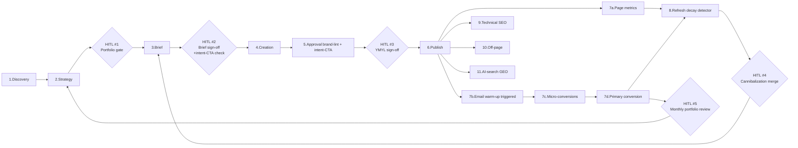

# your-os

> Multi-tenant SEO content OS. One engine, many tenants, zero CMS lock-in.

[](#status) [](LICENSE)

`your-os` is the engine that powers Career Hub (B2C, code-mode) and Employer Hub (B2B, Strapi-mode), and is designed to power any other SEO-driven content website. Pick a content storage mode per content-type, pin a schema, and ship.

## Who is this for

Primary persona: a **Growth/Performance Marketing lead** who owns ROOS and pipeline. Secondary: Head of SEO, founder/operator standing up a vertical hub. See [AUDIENCE.md](AUDIENCE.md) for jobs-to-be-done, success metrics, and where the OS earns trust.

If you are a casual blogger, an enterprise SEO team running 50+ properties, or an agency serving unrelated clients — this is not for you. See [AUDIENCE.md](AUDIENCE.md) "anti-personas."

## The closed loop



Note: "AI-citation share" is measured via a **citation portfolio** (multi-URL bibliographies per AI answer) rather than single-URL ranking alone, per the 2026 [SEO_OPERATING_STANDARDS.md](SEO_OPERATING_STANDARDS.md).

Five HITL gates. Everything else autonomous. See [.agents/rules/060-human-in-the-loop.md](.agents/rules/060-human-in-the-loop.md) for the full rule.

## Strategic context

- [MISSION.md](MISSION.md) — operating creed, five principles, what we are NOT.
- [VISION.md](VISION.md) — 12 / 24 month target state, measurable outcomes.
- [AUDIENCE.md](AUDIENCE.md) — primary, secondary, tertiary personas + anti-personas.
- [COMPETITIVE.md](COMPETITIVE.md) — six-category landscape, white space, 2026 signals.
- [AGENTS.md](AGENTS.md) — top-level entry point for AI agents working on the OS.

---

## Status

All seven phases of the [build plan](.agents/PLAN.md) are complete. The full monorepo runs `93 successful, 93 total` Turbo tasks (build + typecheck + test) green across **26 packages, 4 apps, and 4 examples**. Career Hub is **not modified** by anything in this repo — the OS is consumed via published packages.

| Phase | Surface                          | Gate                                                               | State |
| ----- | -------------------------------- | ------------------------------------------------------------------ | ----- |
| 0     | Monorepo skeleton                | `turbo run build typecheck test` passes empty                      | done  |
| 1     | Core packages (config, lint, seo) | brand-lint byte-equivalent to Career Hub's script                  | done  |
| 2     | Heavy packages (core, cli, …)    | `examples/minimal` builds via the CLI                              | done  |
| 2B    | Strapi track (6 packages)        | `examples/minimal-strapi` exercises every Strapi package           | done  |
| 3     | Configurator MVP                 | scaffolds both example tenants from `brief.json`                   | done  |
| 4     | Configurator + AI Research       | Career Hub round-trip matches snapshot with field-level tolerance  | done  |
| 5     | `examples/employer-hub`          | B2B tenant typechecks + uses Strapi adapter                        | done  |
| 6     | `apps/control-plane`             | weekly-digest agent ranks fixture GSC + drafts valid Strapi briefs | done  |
| 7     | `migrate-to-strapi` codemod      | dual-source byte-equivalence harness ships (opt-in only)           | done  |

---

## Architecture in one diagram

The diagram below is **auto-generated** from the real workspace dependency graph (`packages/*/package.json` + `apps/*` + `examples/*`). It is the source of truth — if you add a package or change a dependency edge, run `pnpm run check:architecture --write` and commit the diff.

<!-- BEGIN:architecture-diagram -->
```mermaid
%% AUTO-GENERATED — edit packages/*/package.json then run: pnpm run check:architecture --write
graph TD
  subgraph core["Layer 1 — Core engine"]
    agent_context["agent-context<br/><i>beta</i>"]
    ai_visibility["ai-visibility<br/><i>alpha</i>"]
    analytics["analytics<br/><i>alpha</i>"]
    brand_lint["brand-lint<br/><i>stable</i>"]
    cli["cli<br/><i>beta</i>"]
    console["console<br/><i>alpha</i>"]
    content_source["content-source<br/><i>beta</i>"]
    content_types["content-types<br/><i>beta</i>"]
    core["core<br/><i>alpha</i>"]
    measurement["measurement<br/><i>alpha</i>"]
    pseo_engine["pseo-engine<br/><i>alpha</i>"]
    refresh_engine["refresh-engine<br/><i>alpha</i>"]
    seo["seo<br/><i>beta</i>"]
    skills["skills<br/><i>beta</i>"]
    tenant_config["tenant-config<br/><i>beta</i>"]
    tools_engine["tools-engine<br/><i>alpha</i>"]
  end
  subgraph strapi["Layer 1 — Strapi track"]
    migrate_to_strapi["migrate-to-strapi<br/><i>alpha</i>"]
    strapi_brand_lint_hook["strapi-brand-lint-hook<br/><i>alpha</i>"]
    strapi_codegen["strapi-codegen<br/><i>beta</i>"]
    strapi_deploy["strapi-deploy<br/><i>beta</i>"]
    strapi_seo["strapi-seo<br/><i>beta</i>"]
    strapi_sync["strapi-sync<br/><i>beta</i>"]
    strapi_template["strapi-template<br/><i>beta</i>"]
  end
  subgraph tooling["Tooling configs"]
    eslint_config["eslint-config<br/><i>stable</i>"]
    tailwind_config["tailwind-config<br/><i>stable</i>"]
    typescript_config["typescript-config<br/><i>stable</i>"]
  end
  subgraph app["Apps (configurator / control-plane / docs / web)"]
    configurator["configurator"]
    control_plane["control-plane"]
    docs["docs"]
    web["web"]
  end
  subgraph example["Tenant examples"]
    example_career_hub_snapshot["example-career-hub-snapshot"]
    example_employer_hub["example-employer-hub"]
    example_minimal["example-minimal"]
    example_minimal_strapi["example-minimal-strapi"]
  end
  agent_context --> skills
  agent_context --> tenant_config
  agent_context --> typescript_config
  ai_visibility --> typescript_config
  analytics --> tenant_config
  analytics --> typescript_config
  brand_lint --> tenant_config
  brand_lint --> typescript_config
  cli --> agent_context
  cli --> brand_lint
  cli --> skills
  cli --> tenant_config
  cli --> typescript_config
  console --> control_plane
  console --> measurement
  console --> tenant_config
  console --> typescript_config
  content_source --> tenant_config
  content_source --> typescript_config
  content_types --> typescript_config
  core --> seo
  core --> tenant_config
  core --> typescript_config
  measurement --> tenant_config
  measurement --> typescript_config
  migrate_to_strapi --> content_source
  migrate_to_strapi --> strapi_sync
  migrate_to_strapi --> typescript_config
  pseo_engine --> typescript_config
  refresh_engine --> tenant_config
  refresh_engine --> typescript_config
  seo --> tenant_config
  seo --> typescript_config
  skills --> typescript_config
  strapi_brand_lint_hook --> brand_lint
  strapi_brand_lint_hook --> tenant_config
  strapi_brand_lint_hook --> typescript_config
  strapi_codegen --> strapi_template
  strapi_codegen --> typescript_config
  strapi_deploy --> typescript_config
  strapi_seo --> seo
  strapi_seo --> typescript_config
  strapi_sync --> content_source
  strapi_sync --> typescript_config
  strapi_template --> typescript_config
  tenant_config --> typescript_config
  tools_engine --> typescript_config
  configurator --> cli
  configurator --> strapi_deploy
  configurator --> strapi_template
  configurator --> tenant_config
  configurator --> example_career_hub_snapshot
  configurator --> typescript_config
  control_plane --> content_types
  control_plane --> strapi_template
  control_plane --> tenant_config
  control_plane --> typescript_config
  web --> brand_lint
  web --> configurator
  web --> console
  web --> control_plane
  web --> measurement
  web --> tenant_config
  web --> typescript_config
  example_career_hub_snapshot --> brand_lint
  example_career_hub_snapshot --> tenant_config
  example_career_hub_snapshot --> typescript_config
  example_employer_hub --> agent_context
  example_employer_hub --> brand_lint
  example_employer_hub --> cli
  example_employer_hub --> configurator
  example_employer_hub --> content_source
  example_employer_hub --> content_types
  example_employer_hub --> seo
  example_employer_hub --> skills
  example_employer_hub --> strapi_codegen
  example_employer_hub --> strapi_deploy
  example_employer_hub --> strapi_sync
  example_employer_hub --> strapi_template
  example_employer_hub --> tenant_config
  example_employer_hub --> typescript_config
  example_minimal --> agent_context
  example_minimal --> analytics
  example_minimal --> brand_lint
  example_minimal --> cli
  example_minimal --> content_source
  example_minimal --> content_types
  example_minimal --> core
  example_minimal --> pseo_engine
  example_minimal --> seo
  example_minimal --> skills
  example_minimal --> tenant_config
  example_minimal --> tools_engine
  example_minimal --> typescript_config
  example_minimal_strapi --> agent_context
  example_minimal_strapi --> brand_lint
  example_minimal_strapi --> content_source
  example_minimal_strapi --> content_types
  example_minimal_strapi --> seo
  example_minimal_strapi --> skills
  example_minimal_strapi --> strapi_brand_lint_hook
  example_minimal_strapi --> strapi_codegen
  example_minimal_strapi --> strapi_deploy
  example_minimal_strapi --> strapi_seo
  example_minimal_strapi --> strapi_sync
  example_minimal_strapi --> strapi_template
  example_minimal_strapi --> tenant_config
  example_minimal_strapi --> typescript_config
  classDef stable fill:#e3fcec,stroke:#2f855a,color:#1a202c;
  classDef beta fill:#fffbe6,stroke:#b7791f,color:#1a202c;
  classDef alpha fill:#fee2e2,stroke:#c53030,color:#1a202c;
  class agent_context beta;
  class ai_visibility alpha;
  class analytics alpha;
  class brand_lint stable;
  class cli beta;
  class console alpha;
  class content_source beta;
  class content_types beta;
  class core alpha;
  class eslint_config stable;
  class measurement alpha;
  class migrate_to_strapi alpha;
  class pseo_engine alpha;
  class refresh_engine alpha;
  class seo beta;
  class skills beta;
  class strapi_brand_lint_hook alpha;
  class strapi_codegen beta;
  class strapi_deploy beta;
  class strapi_seo beta;
  class strapi_sync beta;
  class strapi_template beta;
  class tailwind_config stable;
  class tenant_config beta;
  class tools_engine alpha;
  class typescript_config stable;
```
<!-- END:architecture-diagram -->

Node colour reflects `yourOs.stability`: green = stable, amber = beta, red = alpha. Layer subgraphs reflect `yourOs.layer`. Apps and examples are grouped by directory.

The single contract every layer respects is `tenant.config.ts`. Validate it once with `@your-os/tenant-config` and every other package reads from it — including the AI agents (`@your-os/agent-context` renders `AGENTS.md` from the same object).

---

## Content storage is per-content-type

`tenant.config.ts → contentSources` decides **per content-type**:

```ts
contentSources: {
  articles: { mode: "code" },                                  // ships in the repo
  guides:   { mode: "strapi", strapiCollection: "guides" },    // editorial
  cities:   { mode: "hybrid",                                  // editorial overrides on top
              primary:  { mode: "strapi", strapiCollection: "cities" },
              fallback: { mode: "code" } },
}
```

Pages, sitemaps, ISR tags, brand-lint, and the configurator all flow through one `ContentSource<T>` interface (`@your-os/content-source`). A page does not know — and cannot know — where its content came from.

---

## Quickstart — see it work in 60 seconds

```bash
git clone <your-os repo>
cd your-os
pnpm install
pnpm turbo run build typecheck test    # 93/93 should pass
```

Scaffold a tenant from a brief:

```bash
pnpm --filter @your-os/configurator exec node -e '
  import("./dist/index.js").then(async ({ parseBrief, scaffoldTenant }) => {
    const brief = await import("./src/fixtures/minimal.brief.json", { with: { type: "json" } });
    const out = await scaffoldTenant(parseBrief(brief.default), { outDir: "/tmp/my-tenant", dryRun: false });
    console.log(out.files.map(f => f.path).join("\n"));
  })
'
```

You now have a tenant repo at `/tmp/my-tenant` with `tenant.config.ts`, `AGENTS.md`, `.cursor/rules/`, `package.json`, and `README.md`. If `contentStorage.mode` was `strapi`, you also get `strapi/Dockerfile`, `strapi/render.yaml` (or `railway.json` / `fly.toml`), `strapi/.env.example`, `strapi/schema/content-types.json`, and a `RUNBOOK.md`.

Real onboarding lives in `apps/web` (the v1.1 Web Shell), which hosts the configurator's `OnboardingMachine` behind `/onboarding/[stepId]` and renders the headless view models from `@your-os/console` for the admin console and customise surfaces. The `apps/configurator` package remains the framework-agnostic engine consumed by the web shell and any future CLI/TUI.

---

## Packages

Packages are the contract surface. Each ships independently via Changesets; SemVer is honored. `bin` packages have a CLI under their `dist/`.

> The tables below are auto-generated from `packages/*/package.json`. Edit `description` and `yourOs.{layer,stability}` in each `package.json`, then run `pnpm run check:readme --write`.

### Core engine — Layer 1

<!-- BEGIN:packages-core -->
| Package | Stability | Purpose |
| --- | --- | --- |
| `@your-os/agent-context` | beta | Generates per-tenant AGENTS.md / CLAUDE.md / .cursor/rules from tenantConfig + @your-os/skills. |
| `@your-os/ai-visibility` | alpha | AI-search citation tracking. v1 imports Profound/Peec CSV exports; in-house scraping deferred to v2 once design partners confirm citation share matters. |
| `@your-os/analytics` | alpha | GA4/PostHog/Segment helpers + attribution. Conversion event parameterized from tenantConfig.conversion. |
| `@your-os/brand-lint` | stable | DBA prevalence (Romaniuk ≥80%) + banned-phrase + AI-slop + GEO citation density linter. Reads tenantConfig.brand. |
| `@your-os/cli` | beta | `your-os init|add|lint|audit|sync|strapi:*` CLI. Scaffolds new tenant repos and runs ops commands. |
| `@your-os/console` | alpha | Headless admin console: view models + reducers + keyboard map. Framework-agnostic; mounted by apps/web and any future CLI/TUI shell. |
| `@your-os/content-source` | beta | The ContentSource abstraction + Code/Strapi/Hybrid adapters. The seam that lets tenants pick code, Strapi, or hybrid per content-type. |
| `@your-os/content-types` | beta | Generic Article/Guide/Tool/Location/CaseStudy/Pillar/Persona/Brief TS types. CMS-agnostic. |
| `@your-os/core` | alpha | CMS-agnostic page shells: StandardPageLayout, ContentPageShell, ToolPageShell, RolePageShell, FAQSection, CTASection. |
| `@your-os/measurement` | alpha | ROOS forecast + actuals reconciliation + micro-conversion lead-scoring + variance write-back. The closed loop's measurement layer. |
| `@your-os/pseo-engine` | alpha | Programmatic SEO scaffolding. N-dimensional cell generation. Always code-source. |
| `@your-os/refresh-engine` | alpha | Content-decay detector. Surfaces refresh candidates from dateModified + ranking delta + ROOS delta + source data version. Drafts refresh PRs (code-mode) or Strapi briefs (strapi-mode). |
| `@your-os/seo` | beta | Metadata helpers, JSON-LD generators, sitemap, robots.txt builders. |
| `@your-os/skills` | beta | The trimmed ~15-20 skill library that ships TO tenants. Mirrored into per-tenant AGENTS.md by @your-os/agent-context. |
| `@your-os/tenant-config` | beta | The universal `tenant.config.ts` schema. Zod-validated. Every other @your-os/* package reads from here. |
| `@your-os/tools-engine` | alpha | Calculator/decision-tool framework. Tool registry pattern. |
<!-- END:packages-core -->

### Strapi track

<!-- BEGIN:packages-strapi -->
| Package | Stability | Purpose |
| --- | --- | --- |
| `@your-os/migrate-to-strapi` | alpha | Phase 7 codemod: parses TS data files → creates Strapi entries via REST. Opt-in only, never auto-triggered against Career Hub. |
| `@your-os/strapi-brand-lint-hook` | alpha | Strapi beforePublish lifecycle hook → calls @your-os/brand-lint → blocks publish on banned phrases / DBA prevalence < target / missing citations. |
| `@your-os/strapi-codegen` | beta | Introspects a Strapi instance's schema → generates TypeScript types + Zod runtime schemas for StrapiContentSource. |
| `@your-os/strapi-deploy` | beta | Render/Railway/Fly deploy templates with managed Postgres + S3 + nightly backups + restore. |
| `@your-os/strapi-seo` | beta | Strapi plugin bundle: universal SEO fields auto-attached to every content-type, Yoast-style scoring in admin. |
| `@your-os/strapi-sync` | beta | Next.js side of Strapi: /api/revalidate (HMAC-verified webhook → revalidateTag), /api/preview, /api/exit-preview. Tag convention: {tenant}:{contentType}:{slug}. |
| `@your-os/strapi-template` | beta | Strapi 5 schema-as-code template. Default content-types: Article, Pillar, Cluster, Persona, ICP, CaseStudy, OpportunityBrief, RoleGuide. Includes migration runner. |
<!-- END:packages-strapi -->

### Tooling configs (consumed via `extends`)

<!-- BEGIN:packages-tooling -->
| Package | Stability | Purpose |
| --- | --- | --- |
| `@your-os/eslint-config` | stable | Shared lint config (Biome-first). This package re-exports the canonical biome.json for tenants who want to extend it. |
| `@your-os/tailwind-config` | stable | Shared Tailwind CSS v4 design tokens + preset for OS tenants. |
| `@your-os/typescript-config` | stable | Shared tsconfig bases (base/library/nextjs/node) |
<!-- END:packages-tooling -->

> Stability legend: `stable` = SemVer-stable, breaking changes only on majors · `beta` = API may change with a deprecation notice · `alpha` = exploratory, no compatibility guarantee.

---

## Apps and examples

```
apps/
├── web/             ← v1.1 Web Shell. Next.js. Hosts onboarding (configurator UI), admin console, customise/control panel.
├── configurator/    ← Discovery → AI Research → scaffold engine. Framework-agnostic; the web shell is its hosted UI.
├── control-plane/   ← Weekly-digest agent + perf write-back + Slack notifier.
└── docs/            ← Fumadocs public docs site (Fumadocs scaffold; content is being filled in).

# Headless admin console (consumed by apps/web; CLI/TUI shells can also mount it):
# packages/console/  ← view models + reducers + keyboard map. Lives in packages/ since it's a tsup library.

examples/
├── minimal/                ← code-mode tenant. CI gate for every Layer 1 package.
├── minimal-strapi/         ← Strapi-mode tenant + docker-compose. CI gate for the Strapi track.
├── employer-hub/           ← B2B tenant scaffolded by the configurator from a brief.
└── career-hub-snapshot/    ← brand-lint byte-equivalence target for Career Hub extractions.
```

Apps are **not published** to the npm scope — they are CI surfaces and (for `web`) a deployable shell. They are listed in `.changeset/config.json → ignore`.

---

## What this is *not*

- Not a hosted multi-tenant Strapi. Each tenant gets its own Strapi instance (per-tenant secret discipline, no cross-tenant blast radius). Convenience > shared infra.
- Not a CMS. Strapi is one (excellent) backend; code-mode is fully supported and used by Career Hub.
- Not auto-applied to Career Hub. Career Hub stays code-mode unless its team explicitly opts in via `@your-os/migrate-to-strapi` with `--i-confirm-this-is-not-career-hub`.
- Not a UI framework. `@your-os/core` ships unstyled page shells; tenants own their design system (Career Hub uses its own, Employer Hub uses HubSpot-flavoured layouts).

---

## Two `.agents/` folders, two audiences

`your-os/.agents/` guides agents working **on the OS itself**. `packages/skills/` is the catalog shipped **to tenants** (rendered into per-tenant `AGENTS.md` by `@your-os/agent-context`). Don't conflate them — full explanation in [.agents/README.md](.agents/README.md).

---

## Versioning

- Core (Layer 1) packages move together. A breaking change in `@your-os/tenant-config` is a coordinated minor bump across all packages that consume it, with an accompanying codemod when feasible.
- Strapi track packages can move independently of core, but the `strapiTemplate` field in `tenant.config.ts` pins the schema major. Major bumps require an explicit `MigrationRunner.migrate()` step.
- Apps (`web`, `configurator`, `control-plane`, `docs`) and examples (`minimal*`, `employer-hub`, `career-hub-snapshot`) are not published — they're CI surfaces (and for `web`, a deployable shell). All listed in `.changeset/config.json → ignore`. `@your-os/console` is published like any other Layer 1 package since it lives in `packages/`.

---

## Robustness contract

The README itself is treated as production code:

- Every package listed above exists in `packages/` (CI-checked).
- Every package row is generated from `packages/*/package.json` `description` + `yourOs.{layer,stability}` — there is no hand-written package list.
- Every claim with a number ("93/93 turbo tasks") is verifiable by running `pnpm turbo run build typecheck test`.
- Every code path mentioned has a test in the same package (vitest).
- Every "Phase X done" row corresponds to a Changeset entry in `.changeset/` (for package-bearing phases).
- **Dual-track AI visibility KPIs** — measure mentions (presence) and trusted citations (depth) per [SEO_OPERATING_STANDARDS.md §3](SEO_OPERATING_STANDARDS.md#3-measurement-doctrine-3-tier-attribution); off-site signals (Reddit, YouTube, Wikipedia) are first-class.
- The CI job `brand-lint byte-equivalence (REQUIRED)` is the **only required status check** for PR merges. Configure it in GitHub branch protection: Settings → Branches → main → Require status checks → add `brand-lint byte-equivalence (REQUIRED)`. Career Hub depends on this not drifting.

Run `pnpm verify` locally to reproduce all CI gates in order.

If you find drift, open a PR — the README is the contract; reality must match it.

---

## License

[BSL 1.1](LICENSE) — Business Source License 1.1, converts to Apache-2.0 four years after publication. See [LICENSE](LICENSE) for the additional use grant.

## Contributing

See [CONTRIBUTING.md](CONTRIBUTING.md). TL;DR: branch off `main`, add a Changeset (`pnpm changeset`), keep `pnpm turbo run build typecheck test` green, and don't put feature code in `packages/core` (read [`.agents/rules/000-os-architecture.md`](.agents/rules/000-os-architecture.md) for why).
